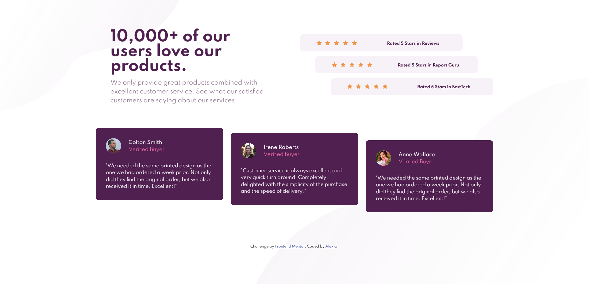
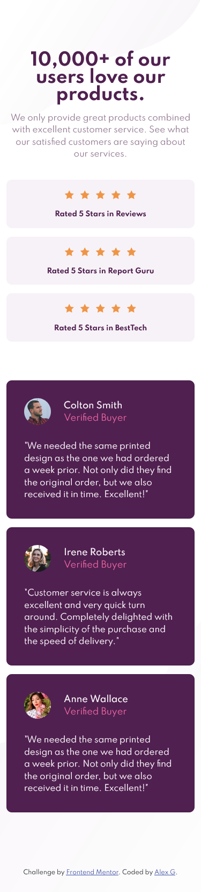

# Frontend Mentor - Social proof section solution

This is a solution to the [Social proof section challenge on Frontend Mentor](https://www.frontendmentor.io/challenges/social-proof-section-6e0qTv_bA). Frontend Mentor challenges help you improve your coding skills by building realistic projects. 

## Table of contents

- [Overview](#overview)
  - [The challenge](#the-challenge)
  - [Screenshot](#screenshot)
  - [Links](#links)
- [My process](#my-process)
  - [Built with](#built-with)
  - [What I learned](#what-i-learned)
- [Author](#author)

**Note: Delete this note and update the table of contents based on what sections you keep.**

## Overview

### The challenge

Users should be able to:

- View the optimal layout for the section depending on their device's screen size:
    **375px** & **1440px**

### Screenshot

- Desktop view: 

- Mobile view

### Links

- Solution URL: [https://www.frontendmentor.io/solutions/mobile-first-solution-using-bootstrap-pZ1vqWNyx](https://www.frontendmentor.io/solutions/mobile-first-solution-using-bootstrap-pZ1vqWNyx)
- Live Site URL: [https://alexgdevpro.github.io/FEM_Ch-5_Social-proof-section-master/](https://alexgdevpro.github.io/FEM_Ch-5_Social-proof-section-master/)

## My process

### Built with

- Mobile-first workflow
- CSS custom properties
- [Bootstrap](https://getbootstrap.com/) - CSS Framework

### What I learned

I increased my Bootstrap skills even though I'm still having trouble placing items.

## Author

- Website - [https://alexgdevpro.github.io/](https://alexgdevpro.github.io/)
- Frontend Mentor - [@AlexGDevPro](https://www.frontendmentor.io/profile/AlexGDevPro)
- Twitter - [@AlexGDevPro](https://twitter.com/AlexGDevPro)
